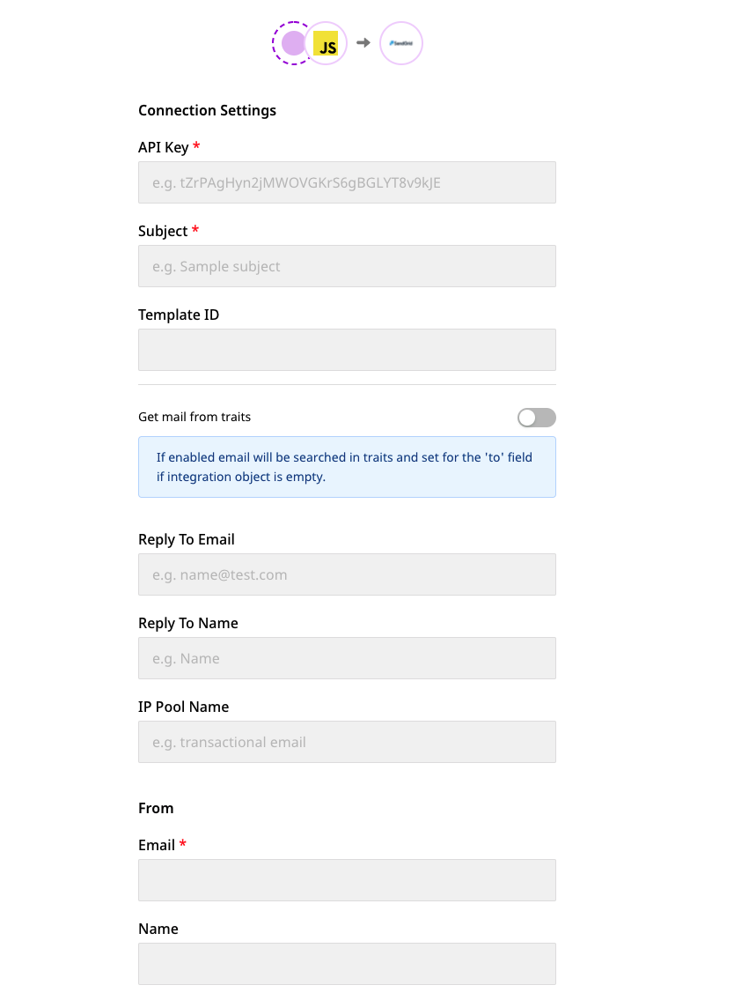
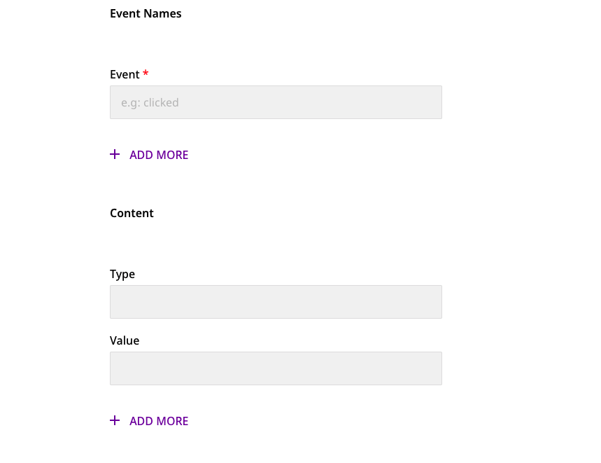
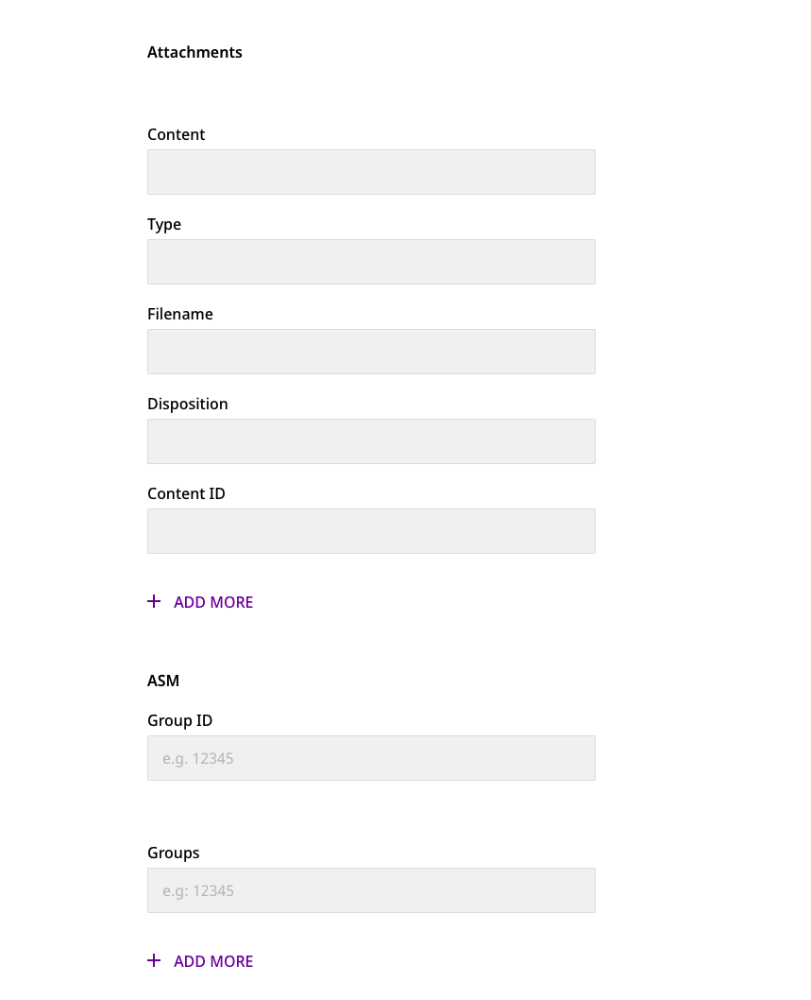
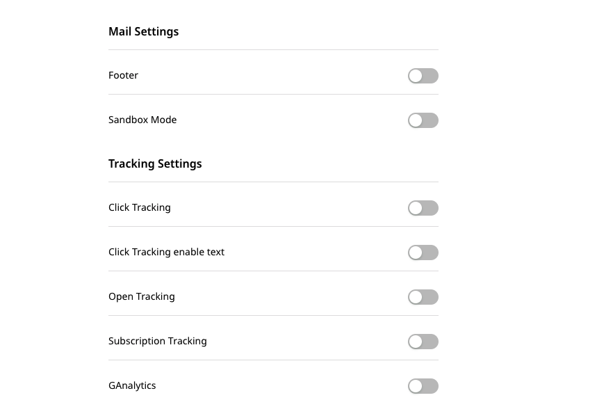

# SendGrid

[**SendGrid**](https://sendgrid.com/) is a cloud-based email marketing platform built for marketers and developers. It helps businesses deliver billions of transactional and marketing emails every month.

RudderStack supports SendGrid as a destination to which you can seamlessly send your customer data.

## Getting started

Before configuring SendGrid as a destination in RudderStack, verify if the source platform is supported by SendGrid by referring to the table below:

| **Connection Mode** | **Web**       | **Mobile** | **Server**    |
| :------------------ | :------------ | :--------- | :-------------|
| **Device mode**     | -             | -          | -             |
| **Cloud mode**      | **Supported** | -          | **Supported** |


To know more about the difference between Cloud mode and Device mode in RudderStack, read the [**RudderStack connection modes**](https://docs.rudderstack.com/get-started/rudderstack-connection-modes) guide.


Once you have confirmed that your source platform supports sending events to SendGrid, follow these steps:

* From your [**RudderStack dashboard**](https://app.rudderstack.com/), add the source. From the list of destinations, select **SendGrid**.


Follow our guide on [**Adding a Source and Destination in RudderStack**](https://docs.rudderstack.com/how-to-guides/adding-source-and-destination-rudderstack) for more information.


* Assign a name to the destination and click on **Next**. You should then see the following screen:






### Connection settings

The connection settings required to configure SendGrid as a destination in RudderStack are listed below.

* Enter your SendGrid **API Key**.


To get the SendGrid API Key, click [**here**](https://app.sendgrid.com/settings/api_keys). You can also send the subject via the `integrations` object in the `track` call.


* Enter the **Subject**. 


For more information on the `integrations` object, refer to the [**Track**](#track) section below.


* Next, enter the **Template ID**. 


To get your template ID or create a new one, go to your [**SendGrid dashboard**](https://app.sendgrid.com/). Then, click on **Email API** and go to **Dynamic Templates**.



The Template ID can also be sent via the `integrations` object. Note that the template ID passed via the `integrations` object (`templateId`) will override the ID specified in the RudderStack dashboard.


```javascript
"templateId": "valueHere"
```

* Next, you can enable or disable the **Get mail by traits** option. If enabled, this option allows RudderStack to search for the user's `email` inside the user's `traits`. If it is found, then the event can be sent to SendGrid without the `integrations` object.


Note that this option is only useful when the `integrations` object is empty. SendGrid also requires either the `templateId` or `content` to be present for a successful event delivery.  


* Enter the email address in the **Reply To Email** option, where the email replies or bounces will be returned.

* In **Reply To Name** , enter the name of the user associated with the above email address.


You can also send the email and name inside the `replyTo` object via `integrations` object. Note that these fields will override the **Reply To Email** and **Reply To Name** fields set in the RudderStack dashboard.



For more information on how to send these details via the `replyTo` object, refer to the [**Track**](#track) section below.


* Next, enter the **IP Pool Name**.


The length of the IP Pool Name should be between 2 and 64 characters. For detailed steps on creating the IP pool name, refer to the [**SendGrid documentation**](https://docs.sendgrid.com/ui/account-and-settings/ip-pools#create-an-ip-pool).


#### From

* Enter the **email** address via which email will be sent.


For more information on creating a verified sender identity, refer to this [**SendGrid documentation**](https://docs.sendgrid.com/ui/sending-email/sender-verification).


* Enter the **name** associated with above email.


You can additionally include `email` and `name` inside the `from` object via the `integration` object (shown below), which will override the fields specified in the RudderStack dashboard.


```javascript
from:{
    "email": "test@email.com",
    "name": "test"
}
```

#### Event Names

* Next, create the list of **events** for which the `track` calls will be made. 


If a `track` call is made with event not in this list, the call will be **dropped**.


#### Content

* To specify the **content** of your email, enter the **type** and **value**.

    * The **type** field is the type of the value to be included in the **value** field.
    * The **value** field contains the actual value that is to be included in the email.


The `content` array can also be sent via `integrations` object (shown below), which will override the dashboard settings.


```javascript
content: [
    {
        "type": "text/plain",
        "value": "sample text"
    }
]
```

#### Attachments

Use the **Attachments** settings to specify any attachments you want to include in your email. The individual settings are as follows:

* **content**: This should be a Base64-encoded string (`base64encodedString`).

* **type**: The attachment **type** contains the type of content you are attaching e.g. `"text/plain"`, `"text/html"`, etc.

* **filename**: Use this setting to specify the attachment's file name.

* **disposition**: This option specifies how you would like the attachment to be displayed.

* **content ID**: Use this option when **disposition** is set to `inline` and the attachment is an image.



SendGrid requires that each attachment element must contain **content** and **filename**. The attachments can also be sent via the `integrations` object (shown below) which will override the dashboard settings.


```javascript
attachments:[
    {
        "content": "base64encodedString",
        "filename": "index.html",
        "type": "text/html",
        "disposition": "attachment"
    }
]
```

#### ASM

The **ASM** settings allow you to handle unsubscribes. The configurable options are:

* **Group ID**: This option specifies the unsubscribe group to associate with this email.
 
* **Groups**: This option contains the array of unsubscribing groups that would be displayed in the Unsusbcribe preferences page.


SendGrid requires that the **Group ID** should always be present if the `asm` object is to be sent.


#### Mail Settings

* To include a default footer in every mail, enable the **Footer** option. When enabled, the **text** option contains the plain content of footer. The **HTML** contains the HTML content of footer.


The footer can also be sent via `integrations` object (shown below), which will override the dashboard settings.


```javascript
mailSettings:{
    "footer": true,
    "footerText": "plain text",
    "footerHtml": "html content"
}
```

* To send a test mail and ensure everything is correct, you can enable the **Sandbox Mode** setting.


The sandbox mode can also be enabled or disabled via the `integrations` object (shown below), which will override the dashboard setting.


```javascript
mailSettings:{
    "sandboxMode": true
}
```

#### Tracking Settings

The following table describes the various tracking settings to be configured in the RudderStack dashboard:

| **Setting** | **Description** |
|:--------|:------------|
|**Click Tracking** | Allows you to track if a recipient clicked a link in your email.|
|**Click Tracking enable text** | Indicates if this setting should be included in the text/plain portion of your email. |
|**Open Tracking** |Allows you to track if the email was opened by including a single pixel image in the body of the content. |
|**Substitution Tag** | When **Open Tracking** is enabled, this setting allows you to specify a substitution tag that you can insert in the email body at a specific location.|
|**Subscription Tracking** |Allows you to insert a subscription management link at the bottom of your email's text and HTML bodies. |
|**Text**|When **Subscription Tracking** is enabled, this setting refers to the string to be appended to the email with the subscription tracking link. |
|**HTML**|When **Subscription Tracking** is enabled, this is appended to the email with the subscription tracking link.|
|**Substitution Tag** | Refers to the tag that will be replaced with the unsubscribe URL.|
|**GAnalytics** |Allows you to enable Google Analytics tracking. |
|**utm source** |Refers to the name of the referrer source, e.g. Google. |
|**utm medium** | Refers to the name of the marketing medium, e.g. Email.|
|**utm term**| This setting is used to identify any paid keywords.|
|**utm content**  | Allows you to differentiate your campaign from advertisements.|
|**utm campaign** | Corresponds to the name of the campaign.|


The **utm source**, **utm medium**, **utm term**, **utm content**, **utm campaign** options are associated with the **GAnalytics** setting on the dashboard.


Finally, click on **Next**. SendGrid will now be enabled as a destination in RudderStack.

## Track

The `track` call lets you send an event to SendGrid along with its properties inside the `integrations` object. Note that the properties specified within this object will override the settings specified in the RudderStack dashboard.


Note that SendGrid requires either the `templateId` or `content` to be present in the body. Otherwise, the event will be discarded.


A sample `track` call is shown below:

```javascript
rudderanalytics.track('testing',{ "someField": "value" },
      {
        "integrations": {
          "Sendgrid": {
          "personalizations": [
          {
            "to": [
              {
                "email": "recipient@email.com",
                "name": "Name"
              }
            ],
            "cc": [
                {
                    "email": "ccUser@gmail.com",
                    "name": "CCUser"
                },
                {
                    "email": "ccUser2@gmail.com",
                    "name": "CCUser2"
                }
            ],
            "subject": "subject"
          }
        ],
        "from": {
            "email": "test@email.com",
            "name": "Name here"
        },
        "attachments":[
            {
                "content": "base64encodedString",
                "filename": "index.html",
                "type": "text/html",
                "disposition": "attachment"
            }
        ],
        "content":[
            {
                "type": "text/html",
                "value": "<p>Hello</p>"
            }
        ],
        "templateId": "value",
        "headers":{
            "key": "value"
        },
        "customArgs":{
            "key": "value"
        }
        "categories": ["sample","values","here"],
        "sendAt": 1617260400,
        "batchId": "some valid batch ID",
        "subject": "Subject Value",
        "mailSettings":{
          "bypassBounceManagement": true,
          "bypassSpamManagement": true,
          "bypassUnsubscribeManagement": true
          "footer": true
          "footerText": "text",
          "footerHtml": "html",
          "sandboxMode": true
        },
        "replyTo":{
          "email": "testingreplyto@email.com",
          "name": "Name"
        },
        "field1": "value"
      }
    }
  });
```
The following sections highlight some important things to keep in mind while using the `track` call to send customer data to SendGrid.

### `categories`

SendGrid allows the `categories` array to have a maximum of 10 values.

### `customArgs`

If `customArgs` is not provided in the `track` call, the non-default fields are taken as custom fields. In the sample `track` call above, `field1` will be mapped inside `customArgs`.

### Mail settings

To send the event to SendGrid successfully, the following points must be kept in mind:

* In the `mailSettings`, you cannot combine `bypassListManagement` with `bypassBounceManagement`, `bypassSpamManagement`, and `bypassUnsubscribeManagement`. 

* If `bypassListManagement` is present, then neither `bypassSpamManagement`, `bypassBounceManagement`, nor `bypassUnsubscribeManagement` can be present.

### `personalizations` 

SendGrid requires that the `personalizations` array should be present in every event and each object must contain the field `to`. 

If the **Get mail from traits** option is enabled in the RudderStack dashboard and the `integrations` object is not sent, RudderStack will look for the `email` in the event traits. If found, RudderStack will create a `personalizations` object and assign email to the `to` field. 

In case both **Template ID** and **content** are not assigned in the dashboard settings, the event will not be sent as either of Template ID or content is mandatory.

### `replyTo`

Note that SendGrid doesn't allow only `name` to be sent in the `replyTo`  object. `email` must be present too, otherwise the `replyTo` object will be ignored.

A sample `replyTo` object is as shown:

```javascript
replyTo:{
    "email": "test@email.com",
    "name": "test"
}
```

### `asm`

It is mandatory to have the `groupId` field inside the `asm` object.

### Event name

As mentioned in the [**Connection settings**](#connection-settings) section above, the event names for which a `track` call is made must be specified in the RudderStack dashboard. In the sample `track` call above, `testing` is the event name that should be configured in the dashboard. Otherwise, the call will be dropped.

### `content`

Each object inside `content` array must contain the `type` and `value` fields. If these fields are absent, then the object will be dropped. However, note that the call will **not** be dropped.

### `attachments`

Each object inside attachments array must atleast contain the `content` and `filename` fields. If these fields are absent, then the object will be dropped. However the call will **not** be dropped.

## Contact us

If you come across any issues while configuring or using SendGrid with RudderStack, you can [**contact us**](mailto:%20docs@rudderstack.com) or start a conversation on our [**Slack**](https://rudderstack.com/join-rudderstack-slack-community) channel.
